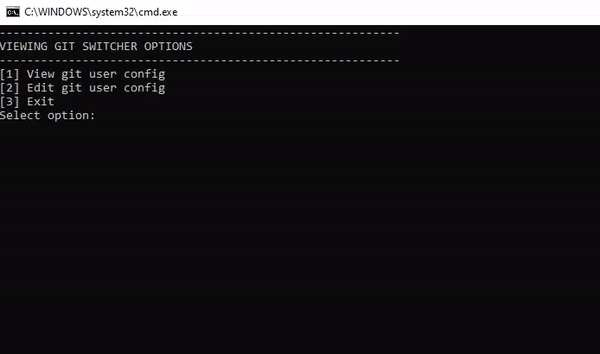

# git-switcher

The **git-switcher** repository contains simple, no-external dependency (except for Git) Windows batch scripts that offer easy switching between different Git global user account identities, resetting the Git user's password for GitHub, GitLab, or BitBucket using two (2) options:

- Windows Credential Manager using `main-wincred.bat`
- A `~/.gitcredential` file using `main.bat`

After a successful Git global account switch and password reset using `main.bat`, subsequent Git pull/push/fetch will prompt for the Git user password or Personal Access Token (PAT).

> Subsequent Git pull/push/fetch will NOT prompt for the Git user password or Personal Access Token (PAT) if this token is provided in the `.env` file when using the `main-wincred.bat` script.

<br>

**main-wincred.bat**




### Dependencies

1. Windows 10 OS 64-bit
2. [Git Bash](https://gitforwindows.org/) for Windows
	- Tested on versions 2.33.0.windows.1 and 2.42
	- Installed using default options
3. Git account
	- GitHub, Gitlab, Bitbucket
4. Windows Credential Manager
   - Installed by default in Windows machines
5. (Optional) Gpg4win [[link]](https://www.gpg4win.org/)
   - Installing Gpg4win and signing commits with a GPG key is optional.
   - For reference, this project uses the following specs:
      ```
      KLEOPATRA
      Kleopatra v3.2.2.231170 (Gpg4win-4.3.1)
      KDE Frameworks v5.109.0
      Qt v5.15.9 (built against 5.15.9)

      GPG
      (Installed with Kleopatra)
      gpg (GnuPG) 2.4.5
      libgcrypt 1.10.3
      ```

## Table of Contents

- [Dependencies](#dependencies)
- [Scripts](#scripts)
   - [`main.bat`](#mainbat)
   - [`main-wincred.bat`](#main-wincredbat)
- [Installation](#installation)
- [GitBash Configuration (Windows OS only)](#gitbash-configuration-windows-os-only)
   - [GitBash Configuration with `main.bat`](#gitbash-configuration-with-mainbat)
   - [GitBash Configuration with `main-wincred.bat`](#gitbash-configuration-with-main-wincredbat)
- [Usage](#usage)

## Scripts

### **main.bat**
   - Windows batch script to automate git user (view, edit, and reset password) commands from a `~/.gitcredential` file.
   - This script only sets the global git user name and email.
   - Follow the instructions for setting up Git Bash for usage with this script at [GitBash Configuration with main.bat
](#gitbash-configuration-with-mainbat).

      > _**WARNING:** This script stores a Git user's password or Personal Access Token (PAT) in a `~/.gitcredential` plain-text file, which may be unsafe. Consider using the **main-wincred.bat** script to ensure stricter Git account security using the Windows Credential Manager._

### **main-wincred.bat**
   - Windows batch script to automate git user (view, edit, and reset password) commands from the **Windows Credential Manager**.
   - Aside from setting the global git user name and email, this script also has options for setting the global git GPG signing key and automatically setting the Git user's Personal Access Token (PAT) in the Windows Credential Manager from the `.env` file.
   - Follow the instructions for setting up Git Bash for usage with this script at [GitBash Configuration with main-wincred.bat](#gitbash-configuration-with-main-wincredbat).

      > **INFO** This script requires Git user account information in a `.env` file. Check out the required and optional keys and structure format of the `.env` file in the [Installation](#installation) section.

## Installation

1. Clone this repository.<br>
`git clone https://github.com/weaponsforge/git-switcher.git`

2. Select a Windows batch script to use: `main.bat` or `main-wincred.bat`.
   - Follow the GitBash Configuration Steps from the preceding sub-sections for a selected script.

3. Create a `.env` file following the pipe-delimited content format of the `.env.example` file to use with the **main-wincred.bat**. Replace its variables with actual values corresponding to Git accounts that you have access to. Create entries per line as many as needed.

   | Key | Description |
   | --- | --- |
   | GIT_PROVIDER | Online Git provider. Currently, supported providers or platforms are [GitHub](https://github.com/), [GitLab](https://gitlab.com/), and [BitBucket](https://bitbucket.org/).<br>Accepted values are `github` (for GitHub), `gitlab` (for GitLab), and `bitbucket` (for BitBucket). |
   | GIT_USERNAME | Git user name associated with the `GIT_PROVIDER` |
   | GIT_EMAIL | User email associated with the `GIT_USERNAME` |
   | GPG_KEY | (Optional) GPG key linked with the Git account for signing commits.<br>If no GPG keys are set but there's a Personal Access Token (PAT), set its value to a hyphen `"-"`.<br><br><blockquote>**INFO:** This option requires a GPG key linked and set-up with the Git account using the [Gpg4win](https://www.gpg4win.org/) software.</blockquote> |
   | PERSONAL_ACCESS_TOKEN | (Optional) Git account's Personal Access Token (PAT)<br><br><blockquote>The **main-wincred.bat** script will set the generic target and password in the Windows Credential Manager if this value is provided. Succeeding Git `pull/push/fetch` will no longer prompt for the Git user password or Personal Access Token (PAT).</blockquote> |

   Example `.env` file:
   ```
   github|myaccount|hello@gmail.com|12345|86473212
   github|mysecond|second@gmail.com|45678
   gitlab|worldtest
   gitlab|tester|testing@gmail.com|-|22222222
   bitbucket|myother|other@gmail.com
   ```

4. Read the [Usage](#usage) section for reference on using the scripts after setting up GitBash from step **# 2**.

## GitBash Configuration (Windows OS only)

### GitBash Configuration with `main.bat`

Configure your GitBash first with the following settings before using the script.

> ***WARNING:** These settings remove the Windows Credential Manager process handling for Git to a text-based ".gitcredentials" file from an easy-to-access location. Proceed at your discretion.*

1. Open a command prompt as an **Administrator**  and run the command:<br>
`git config --global credential.helper "store --file ~/.gitcredential`
2. Delete your **github** access credentials from the **Windows Credentials Manager**.
   - Search for **Credential Manager** from the Search box.
	 - Click the **Windows Credentials** button.
	 - Find and delete the entry for **Github**, **Gitlab**, or **Bitbucket**
3. Run `git config --list --show-origin` to view updates.
   - Verify that the command created `.gitconfig` and `.gitcredential` files in **C:\Users\\[USER_NAME]**.
4. Step no.'s 1-3 have been tested for only **GitBash v2.33 - v2.36**. Do the following steps to ensure compatibility with GitBash versions higher than **v2.36+**.
5. Create a backup of the GitBash `gitconfig` file, usually found in the location:<br>
`C:\Program Files\Git\etc\gitconfig`
6. Edit the **gitconfig** file. Delete the following lines and SAVE. (You may need Administrator access to edit the file).<br>
   ```
   [credential]
	   helper = manager
   ```
   - Restore the deleted lines anytime as needed.
   - Take note the git-switcher script will not work after restoring the deleted lines.

### GitBash Configuration with `main-wincred.bat`

1. GitBash requires no further setup when using the Windows Credential Manager for managing Git accounts.
2. Undo the GitBash setup steps from [GitBash Configuration with `main.bat`](#gitbash-configuration-with-mainbat), if these steps were previously used.

## Usage

> **INFO:** `main-wincred.bat` requires Git user accounts data set in a `.env` file.

Click to run the windows batch script file **main-wincred.bat** or **main.bat**. You may need to run it as an **Administrator** if there will be privilege errors.

1. Select **Option [1]** to **View** the current Git user's global `user.email` and `user.config`.
   - **main-wincred.bat** will also display the `user.signingkey`
2. Select **Option [2]** to **Edit** the current global `user.email` and `user.config`.<br>You will be prompted for which Git version control provider would you like to reset the password.
   - Select sub-option **[1]** for **GitHub**.
   - Select sub-option **[2]** for **GitLab**
   - Select sub-option **[3]** for **BitBucket**
   - Select sub-option **[4]** to **Exit**
3. Select **Option [3]** to exit.
4. Press **Ctrl + C** to exit any time.

20191026